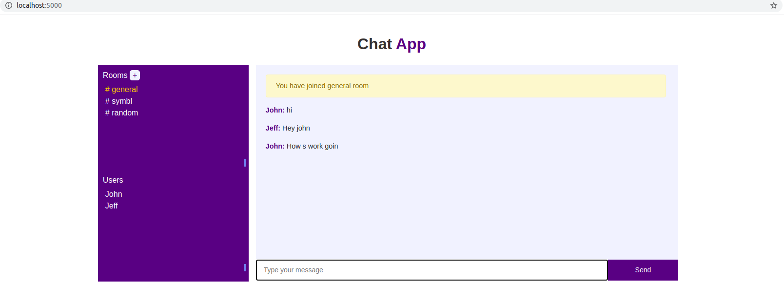

# Chat Application

-A multi-user multi-room chat application built with nodejs and socket.io.

-Apis to check about current state in a chat room/channel and likelihood of user sending message in the next 1 minute at any given time.

## Live demo url
 
 [link](https://symbl-chat.herokuapp.com/)

Features:
 - Multiple users can chat together in real-time
 - Users can create new rooms
 - Users can join/leave different rooms
 - All users get notified when a user joins/leaves their current room 
 - Apis (Get state of a room, Get likelihood of user sending message in 1 minute)

To install dependency:

`npm install`

To run app:

`npm start`

Open your browser and go to:

`localhost:5000`

Test case:

`npm test`
           - 2 apis are unit tested using libraries mocha and chai.
